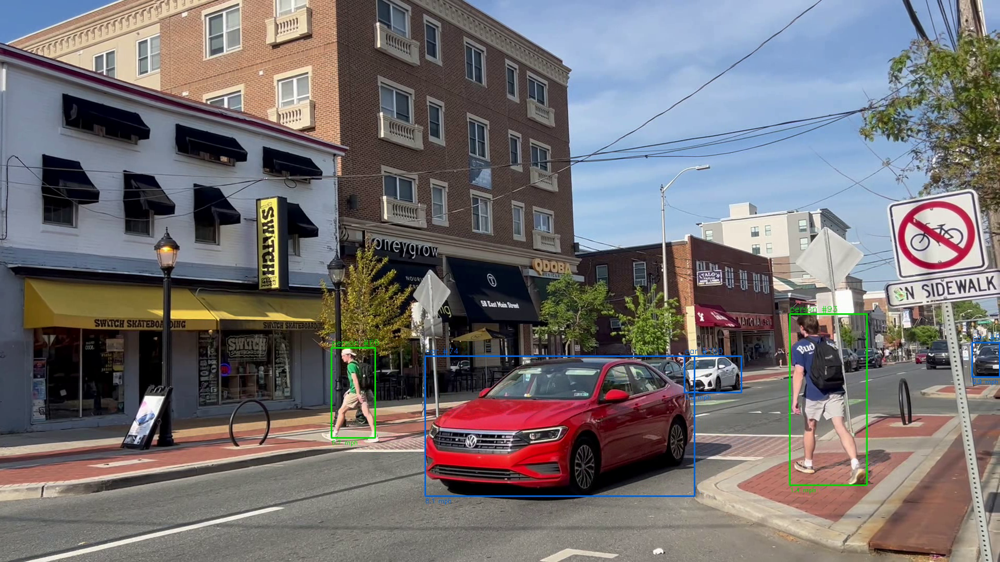
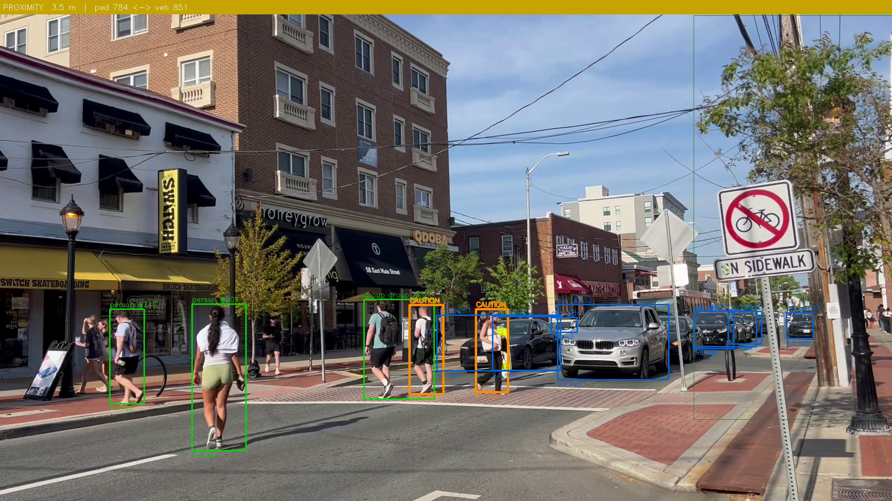
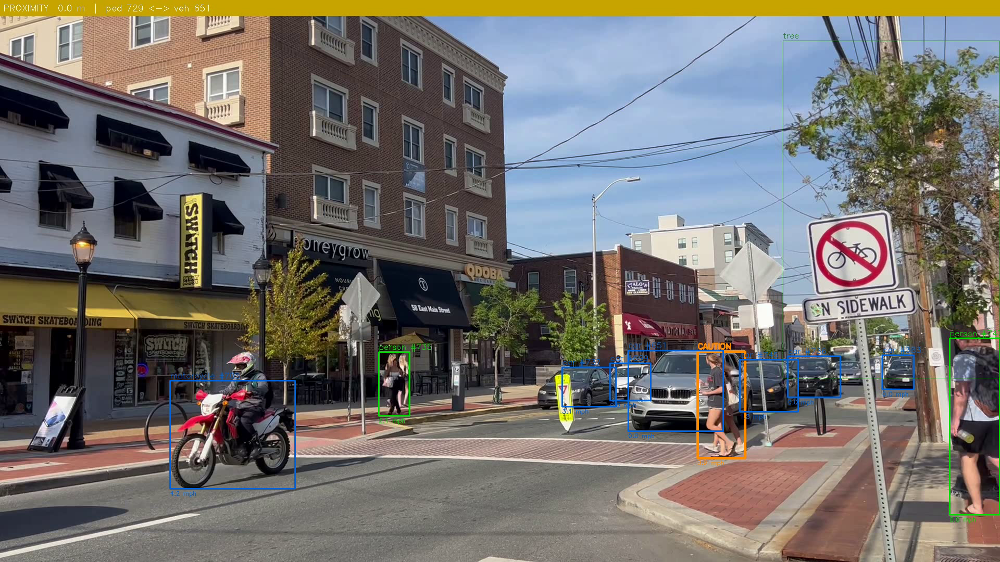

# Campus Pedestrian-Vehicle Risk Analyzer

[](https://github.com/redddddyyyyy/campus-risk-cv/actions)

[](LICENSE)


Detects pedestrians and vehicles from a fixed campus crosswalk camera, projects them into real-world bird's-eye-view coordinates using homography, and flags risk events when a pedestrian in the crosswalk zone gets dangerously close to a moving vehicle.

**v15.6** — 3,872 frames processed, 118 risk events (117 PROXIMITY, 1 TTC_WARNING at frame 2977).

---

## Quick Start

```bash
# 1. Create virtual environment and install dependencies
python -m venv .venv
.venv\Scripts\activate       # Windows
# source .venv/bin/activate  # Mac/Linux

pip install -r requirements.txt

# 2. Place the source video
#    Copy your crosswalk video into data/  (see data/README.md)

# 3. Run the pipeline
python -m src.main \
    --video data/IMG_5757.MOV \
    --output outputs/my_run.mp4 \
    --csv outputs/my_run.csv \
    --config configs/zones_img5757.yaml

# 4. Run tests
python -m pytest tests/
# Expected: 82 passed
```

### Expected output
```
Homography: ON  (caution=2.5 m, danger=1.25 m, min_speed=1.0 mph)
frame 300  events so far: 1
...
Done. 3872 frames processed — 118 risk events logged.
```

---

## How It Works

The pipeline runs five stages per frame:

**1. Detect + Track** — YOLO12n detects people and vehicles each frame. ByteTrack assigns stable IDs across frames. A static-pedestrian filter removes yield-to-pedestrian signs that YOLO misclassifies as people.

**2. Homography** — Four image points on the brick crosswalk are mapped to their real-world positions (7.15 m × 3.0 m plane). After this step every object's ground-contact point is in metres, not pixels.

| Safe (green) | Proximity warning (orange) | TTC warning (red) |
|:---:|:---:|:---:|
| pedestrian in zone, no threat | BEV distance < 2.5 m, on collision path | bbox overlap with moving vehicle |





**3. Zone gate** — Only pedestrians inside the crosswalk polygon are eligible for risk scoring. A 3-frame hysteresis prevents flicker at the polygon edge.

**4. Risk scoring** — For each ped-vehicle pair inside the zone:
   - If the pedestrian's bbox directly overlaps a moving vehicle → **TTC_WARNING** (red)
   - If BEV distance < 2.5 m and on a collision path → **PROXIMITY** (orange)
   - Otherwise → safe (green)

**5. Output** — Annotated video with colored boxes and a top banner for active warnings. Event CSV logs frame, timestamp, IDs, distance, and risk label.

---

## Model Weights

Model weights are not included in the repo. On first run, `ultralytics` downloads them automatically:

```bash
# yolo12n.pt downloads automatically when you run the pipeline
# To pre-download manually:
python -c "from ultralytics import YOLO; YOLO('yolo12n.pt')"
```

---

## Project Structure

```
campus-risk-cv/
├── src/
│   ├── main.py              # frame loop — ties everything together
│   ├── detector_tracker.py  # YOLO12n + ByteTrack wrapper
│   ├── homography.py        # perspective transform (image px → real metres)
│   ├── risk_scoring.py      # zone gate, distance checks, TTC logic
│   ├── visualization.py     # draw colored boxes + banner on each frame
│   └── utils.py             # distance, velocity, polygon helpers
├── tests/                   # 82 pytest tests
├── configs/
│   ├── zones_img5757.yaml   # calibration for IMG_5757.MOV
│   └── zones.yaml           # generic template for new camera angles
├── scripts/
│   ├── homography_picker.py # GUI tool to pick calibration corners
│   ├── calibrate_mpp.py     # meters-per-pixel calibration
│   ├── pixel_ruler.py       # measure real-world distances in image
│   └── extract_frames.py    # extract sample frames from video
├── assets/
│   ├── demo.gif             # annotated video demo
│   ├── sample_safe.png      # safe state — green boxes
│   ├── sample_caution.png   # PROXIMITY caution event
│   └── sample_proximity.png # PROXIMITY close-range event
├── data/
│   └── README.md            # instructions for placing the source video
├── .github/workflows/
│   └── tests.yml            # CI: pytest on push
├── app.py                   # Streamlit interactive demo
└── requirements.txt
```

---

## Configuration

`configs/zones_img5757.yaml` contains:
- **danger_zone** — pixel polygon of the brick crosswalk
- **homography image_points / world_points** — the four calibration corners
- **caution_distance_m** (2.5) and **danger_distance_m** (1.25) — metric thresholds
- **min_vehicle_speed_mph** (1.0) — below this a vehicle is treated as stopped

For a new camera angle, re-pick these four points using `scripts/homography_picker.py`.

---

## Interactive Demo

```bash
streamlit run app.py
```

Opens a browser UI where you can upload a video or use the bundled sample, adjust the event cooldown slider, and see the annotated video + event log + timeline chart.

---

## Tests

```bash
python -m pytest tests/ -v
```

| Module | Tests | What they cover |
|---|---|---|
| test_homography.py | 7 | Perspective transform, BEV coordinate sanity |
| test_risk_scoring.py | 33 | Zone gate, bbox overlap, TTC logic, path check, leaving gate |
| test_main.py | 18 | Argument parsing, CSV writing, frame loop, static-ped filter |
| test_visualization.py | 17 | Color contract, TTC banner text |
| test_utils.py | 7 | Distance, polygon, velocity helpers |

---

## Reference Output (v15.6)

| Metric | Value |
|---|---|
| Frames processed | 3,872 |
| Total risk events | 118 |
| PROXIMITY events | 117 |
| TTC_WARNING events | 1 (frame 2977, 99.24 s) |
| Pedestrian ID | 996 |
| Vehicle ID | 1019 |
| pytest | 82 passed |
